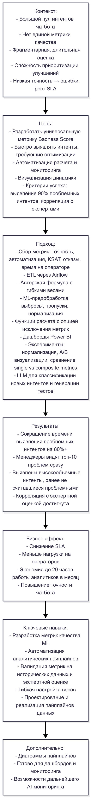

# Badness Score Metric for Intent Quality Monitoring

---

## 🇬🇧 English version

**Timeline:** Q2 2025  
**Role:** Data Analyst / ML Engineer  
**Tech stack:** Python • pandas • numpy • scikit-learn • SQL • Airflow • Power BI • Jupyter Notebook  

### Context
The product team was handling a large pool of chatbot intents, but there was no unified metric to quickly identify intents with degrading quality. Evaluations were fragmented, time-consuming, and it was hard to prioritize improvements across different teams. Low-performing intents led to more errors in automation, higher operator workload, and SLA delays.

### Goal
Develop a universal **Badness Score** metric to:  
- Quickly identify intents that need optimization.  
- Automate calculation and monitoring.  
- Visualize trends across intents and over time.  

**Success Criteria:**  
- Detect 90% of problem intents immediately.  
- Ensure correlation with manual expert assessments.

### Approach

**Data Pipeline**  
- Gather metrics for all intents: accuracy, automation rate, KSAT, drop-offs, operator handling time.  
- ETL pipeline using Airflow for automated collection and preprocessing.  

**Metric Design**  
- Custom formula combining weighted metrics:  
  `Badness_Score = w1*(1-accuracy) + w2*(1-operator_time) + ...`  
- Flexible weighting: different stakeholders can prioritize metrics according to role without manual recalculation.  

**Analytics & Visualization**  
- ML-based preprocessing: outlier detection via percentiles, handling missing values, normalization (Z-score, MinMax).  
- Functions to compute scores with optional metric exclusion or custom thresholds.  
- Power BI dashboards showing top “bad” intents and temporal dynamics.  

**Experiments**  
- Tested normalization approaches for stability.  
- A/B-tested visualizations (tables vs charts).  
- Compared single-metric ranking vs composite Badness Score.  

**AI Support**  
- LLMs used for quick classification of new intents and generation of test examples.

**Evaluation Metrics**  
- Correlation with expert scores.  
- Recall for identifying problem intents (threshold > 0.8).

### Results
- Reduced problem-intent detection time by 80%+.  
- Managers can immediately see the top-10 worst-performing intents.  
- Revealed high-volume intents previously not flagged as problematic.  

### Business Impact
- Reduced SLA violations.  
- Lower operator workload.  
- Saved up to 20 hours of analyst work per month.  
- Increased overall chatbot accuracy.

### Key Skills Highlighted for ML/Analytics Engineer
- Developing quality metrics for ML systems.  
- Automated analytical pipelines for intent monitoring.  
- Metric validation using historical data and expert evaluation.  
- Customizable metric weighting for multi-stakeholder priorities.

### Data Pipeline

---

## 🇷🇺 Русский вариант

**Сроки:** II квартал 2025  
**Роль:** Data Analyst / ML Engineer  
**Технологии:** Python • pandas • numpy • scikit-learn • SQL • Airflow • Power BI • Jupyter Notebook  

### Контекст
Команда работала с большим пулом интентов чатбота, но не существовала единая метрика для быстрого выявления интентов с деградирующим качеством. Оценка была фрагментарной, занимала много времени, и было трудно приоритизировать улучшения для разных команд. Низкая точность интентов приводила к ошибкам автоматизации, увеличению нагрузки на операторов и росту SLA.

### Цель
Разработать универсальную метрику **Badness Score**, которая позволяет:  
- Быстро выявлять интенты, требующие доработки.  
- Автоматизировать расчёт и мониторинг.  
- Визуализировать динамику по интентам и во времени.  

**Критерии успеха:**  
- Выявление 90% проблемных интентов с первого раза.  
- Корреляция с ручной экспертной оценкой.

### Подход

**Data Pipeline**  
- Сбор метрик для всех интентов: точность, автоматизация, KSAT, отказы, время на операторе.  
- Автоматизированный ETL-процесс через Airflow.  

**Метрика**  
- Авторская формула с весами:  
  `Badness_Score = w1*(1-accuracy) + w2*(1-operator_time) + ...`  
- Гибкое управление весами: разные роли могут приоритизировать показатели без ручного пересчета.

**Аналитика и визуализация**  
- ML-предобработка: выявление выбросов по процентилям, работа с пропусками, нормализация (Z-score, MinMax).  
- Функции для расчета с возможностью исключения метрик или задания кастомных порогов.  
- Дашборды в Power BI с топ-10 "плохих" интентов и динамикой изменений.  

**Эксперименты**  
- Тестирование разных нормализаций для устойчивости метрики.  
- A/B-тест визуализаций (таблица vs график).  
- Сравнение ранжирования по одной метрике и комплексной Badness Score.  

**Поддержка AI**  
- LLM использовался для быстрой классификации новых интентов и генерации тестовых примеров.

**Метрики оценки**  
- Корреляция с экспертной оценкой.  
- Recall по выявлению проблемных интентов (порог > 0.8).

### Результаты
- Сокращение времени на поиск проблемных интентов на 80%+.  
- Менеджеры видят топ-10 худших интентов сразу.  
- Выявлены высокообъемные интенты, ранее не считавшиеся проблемными.  

### Бизнес-эффект
- Снижение SLA.  
- Снижение нагрузки на операторов.  
- Экономия до 20 часов работы аналитиков в месяц.  
- Рост точности системы.

### Ключевые навыки
- Разработка метрик качества для ML-систем.  
- Автоматизированные аналитические пайплайны.  
- Валидация метрик на исторических данных и экспертах.  
- Гибкая настройка весов для разных ролей команды.

### Пайплайн

