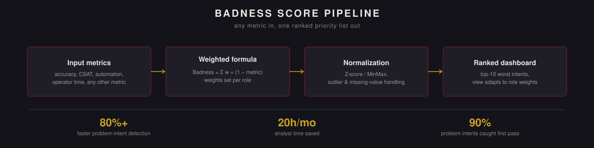

<p align="center">
  
</p>

<p align="right"><a href="README.md">English version →</a></p>

# Badness Score: универсальная метрика мониторинга качества интентов


> **О коде.** Этот репозиторий описывает методологию, ключевые решения и результаты. Реализация является собственностью компании, в которой создавался проект, и не публикуется.

Единая композитная метрика, превращающая разрозненную, фрагментарную картину качества интентов в один ранжированный, настраиваемый по ролям приоритетный список — чтобы любая команда могла сразу увидеть, каким интентам нужно внимание в первую очередь, без отдельного анализа каждый раз.

## Кратко

| | |
|---|---|
| **Время выявления проблемных интентов** | сокращено на 80%+ |
| **Точность выявления** | 90% проблемных интентов пойманы с первого раза, подтверждено на практике |
| **Экономия времени аналитиков** | до 20 часов в месяц |
| **Масштаб** | применяется по всем каналам чат-бота и интентам; используется всеми релевантными ролями, не одной командой |
| **Статус** | принят в работу командой, развивающей сервисы автоматизации чат-бота |

## Проблема

Команда управляла большим пулом интентов чат-бота без единого способа увидеть, какие из них деградируют. Оценка была раздроблена по отдельным, не связанным друг с другом метрикам, что серьёзно затрудняло приоритизацию между командами — проблемный интент мог остаться незамеченным просто потому, что ни одна метрика сама по себе не была достаточно плохой, чтобы привлечь внимание, при этом сочетание нескольких посредственных метрик незаметно наносило реальный вред: больше ошибок автоматизации, выше нагрузка на операторов и рост SLA.

## Подход

**Ключевая идея.** Badness Score не привязан к фиксированному набору метрик — это взвешенная комбинация, куда можно добавить любую метрику:

```
Badness_Score = w1·(1 − accuracy) + w2·(1 − operator_time) + ...
```

Каждый стейкхолдер может настроить веса под то, что важно именно ему — руководитель операций может сильнее взвесить время оператора, а продакт-менеджер — приоритизировать CSAT, — без необходимости перестраивать пайплайн или что-либо пересчитывать вручную.

**Пайплайн данных.** ETL-процесс на Airflow регулярно собирает весь набор входных метрик (точность, доля автоматизации, CSAT, доля отказов, время оператора и другие) по каждому интенту.

**Предобработка.** Выбросы выявляются по перцентильным порогам, пропуски обрабатываются явно, а не отбрасываются молча, метрики нормализуются (протестированы и Z-score, и MinMax), чтобы объединение метрик с очень разными шкалами не смещало результат незаметно в пользу той, у которой просто больше абсолютные значения.

**Визуализация.** Дашборды в Power BI выводят топ-10 худших интентов, при этом ранжирование автоматически обновляется при изменении весов под конкретную роль зрителя.

**Валидация.** Способность метрики выявлять действительно проблемные интенты проверялась относительно ручной экспертной оценки, с использованием recall по выявлению проблемных интентов (целевой порог выше 0.8) в качестве критерия валидации.

**Помощь LLM.** LLM использовался для ускорения классификации новых интентов и генерации тестовых примеров в процессе разработки.

## Результаты

- Время выявления проблемных интентов сокращено более чем на 80%.
- 90% действительно проблемных интентов пойманы с первого раза — подтверждено экспертной проверкой, а не только заложено как цель дизайна.
- Разные роли могли мгновенно увидеть свой собственный топ-10 приоритетов на основе важных именно им метрик, вместо ожидания отдельного анализа.
- Выявлены объёмные интенты, ранее не считавшиеся проблемными при старом, фрагментарном подходе к оценке.

## Влияние на бизнес

- Снижены нарушения SLA за счёт более раннего выявления деградации качества.
- Снижена нагрузка на операторов благодаря более раннему устранению первопричин.
- Сэкономлено до 20 часов работы аналитиков в месяц, ранее уходивших на фрагментарную ручную оценку.
- Внесён вклад в измеримый рост общей точности чат-бота.

## Технологии

Python · pandas · NumPy · scikit-learn · SQL · Airflow · Power BI · Jupyter Notebook

---

<sub>Индивидуальный проект в рамках роли Data / ML Analytics. Описан здесь в портфолио-целях; продовый код не публикуется.</sub>
